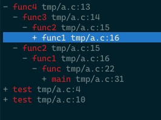

# References

It provides a reference window similar to call tree diagram of source insight.



It depends on [GNU Global](https://www.gnu.org/software/global/).

## Help

```
h, H              Show help
<Enter>           Expand/Collapse
n                 New function
D                 Delete function
j, <ArrowDown>    Down
k, <ArrowUp>      Up
Ctrl+l            Clear
```

## License

[GPLv3](https://www.gnu.org/licenses/gpl-3.0.en.html)
